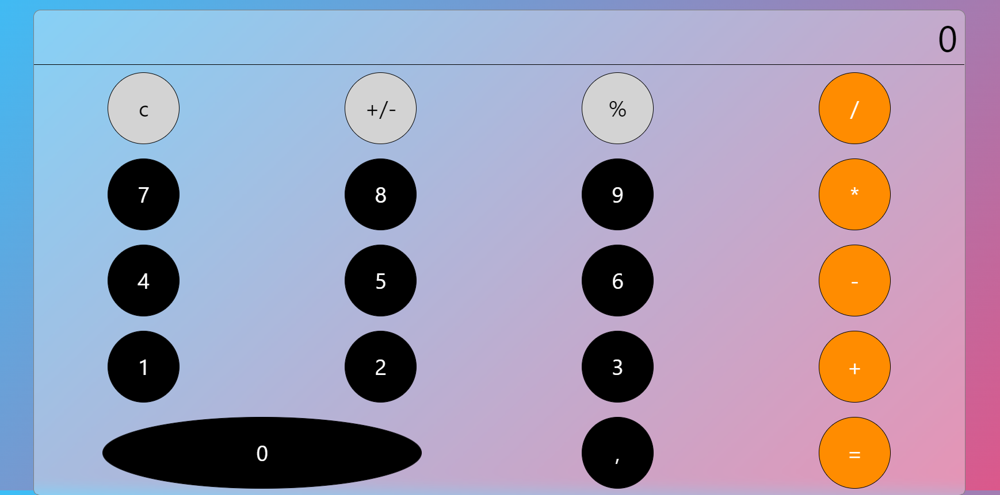

# Calculator made with React

This project is a way for me to use the things I've learned about React and use it in a practical way through the creation of simple yet complex tool: Calculator.

## Progression

So far, most of the features are available, and it's possible to the simple basic operations.

## TODO

- Fixing the last very complex use cases where there are still some bugs.
- I'd like to add several options, such as the possibility to interact with the calculator through keys and not clicks.

## Preview

